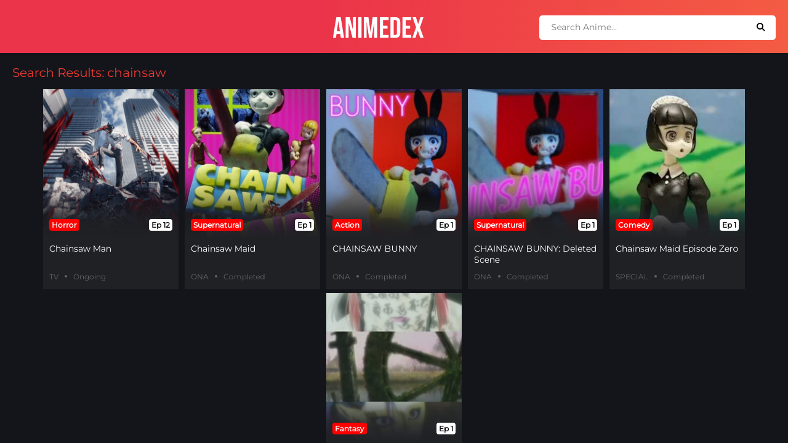
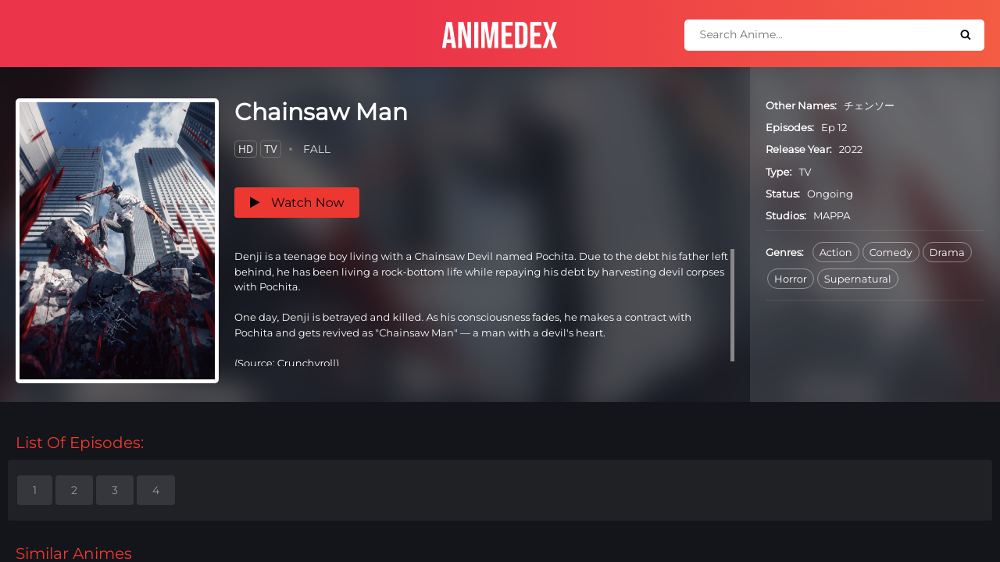
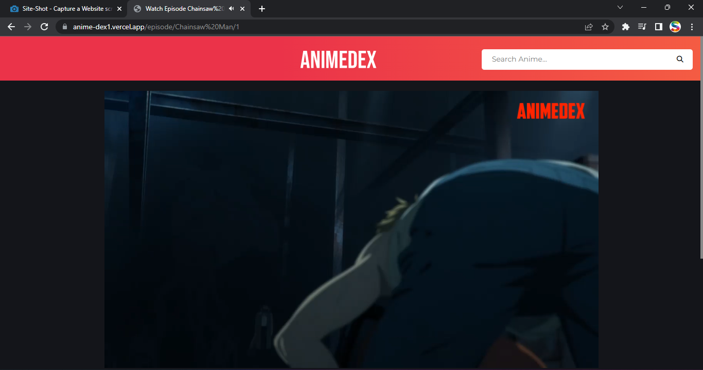

<p align="center"><a href="https://github.com/TechShreyash/AutoAnimeBot"></a></p> 

<h1 align="center"></h1>
<h2 align="center"><b>Watch Animes Online For Free</b></h4>

<p align="center" >   </p>

[](https://betteruptime.com/?utm_source=status_badge)

<hr>

- Built With Flask In Python
- Fast And Responsive
- Uses Anilist To Get Data
- And GoGo Anime For Episodes
- Can Be Deployed To Vercel.com And Repl.it OR Any Other Hosting Service

<hr><br>

### ⚡️ Deploy Your Own
<br>

- Click Below To Deploy On Vercel

    [](https://vercel.com/new/clone?repository-url=https%3A%2F%2Fgithub.com%2FTechShreyash%2FAnimeDex&project-name=anime-dex&repo-name=anime-dex&demo-title=AnimeDex&demo-description=Watch%20Animes%20Online%20For%20Free&demo-url=https%3A%2F%2Fanimedex.live%2F&demo-image=https%3A%2F%2Fgithub.com%2FTechShreyash%2FAnimeDex%2Fraw%2Fmain%2Fstatic%2Fhome.png)

    - Demo : https://anime-dex1.vercel.app

- Deploy To Repl.it

    - Just Fork This Repl To Your Account : https://replit.com/@ShreyashDheemar/AnimeDex

    - Demo : https://animedex.shreyashdheemar.repl.co

- Deploy On Server
  - Install Requirements
    
    ```pip3 install -r requirements.txt```
  - Start The Website

    ```python3 main.py```

  - Need Guide : 
    - https://docs.digitalocean.com/tutorials/app-deploy-flask-app/
    - https://flask.palletsprojects.com/en/2.0.x/deploying/

<hr>

### 📸 Screenshots

<br>








<hr>


### 👤 Contact Me
<br>

[](https://telegram.me/TechZBots) [](https://telegram.me/TechZBots_Support)

<hr>
<br>

### ⭐ Credits

* [TechZBots](https://t.me/TechZBots)
* [TechShreyash](https://github.com/TechShreyash)

<br>

### ⛑ Important

* [License](https://github.com/TechShreyash/AnimeDex/blob/main/LICENSE)
